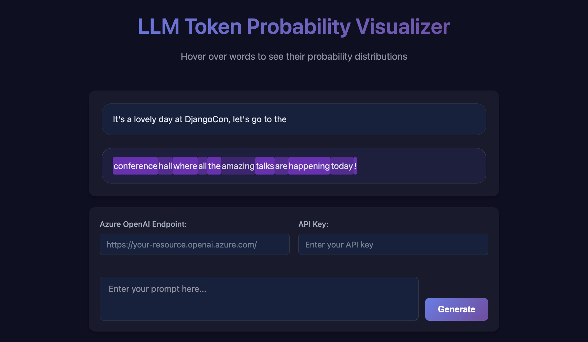

# Token Probability Visualizer

A Flask web application and Jupyter notebook for visualizing LLM token probabilities with interactive hover tooltips.



## 🚀 Quick Start

### Live Demo (GitHub Pages)
Visit the [live demo](https://marlenezw.github.io/token-probability) to see the token probability visualization in action with sample data.

### Local Development (Full Functionality)
For live API integration with Azure OpenAI:

1. **Clone the repository**
   ```bash
   git clone https://github.com/marlenezw/token-probability.git
   cd token-probability
   ```

2. **Install dependencies**
   ```bash
   pip install -r requirements.txt
   ```

3. **Run the Flask app**
   ```bash
   python app.py
   ```

4. **Open your browser**
   Navigate to `http://localhost:5000`

5. **Configure Azure OpenAI**
   - Enter your Azure OpenAI endpoint
   - Enter your API key
   - Start generating responses with token probabilities!

## 🌟 Features

- **Interactive Visualization**: Hover over tokens to see probability distributions
- **Live API Integration**: Connect to Azure OpenAI for real-time token probability analysis
- **Responsive Design**: Works on desktop and mobile devices
- **Demo Mode**: GitHub Pages deployment with sample data for demonstration

## 🛠️ How It Works

### Local Environment
- Full Flask backend with `/api/generate` endpoint
- Real-time API calls to Azure OpenAI
- Live token probability analysis
- Complete interactivity

### GitHub Pages Demo
- Static HTML/CSS/JS deployment
- Pre-loaded sample responses
- Interactive visualization with demo data
- No backend required

## 📁 Project Structure

```
├── app.py                 # Flask application
├── templates/
│   └── index.html        # Main HTML template
├── static/
│   ├── style.css         # Styles
│   ├── script.js         # Original JavaScript (for local)
│   └── script-static.js  # Static version (for GitHub Pages)
├── requirements.txt      # Python dependencies
├── generate_static.py    # Static site generator
└── .github/workflows/
    └── deploy-to-pages.yml # GitHub Actions deployment
```

## 🔧 Technical Details

- **Backend**: Flask with CORS support
- **Frontend**: Vanilla JavaScript with CSS Grid/Flexbox
- **API**: Azure OpenAI with logprobs enabled
- **Deployment**: Dual-mode (local Flask + static GitHub Pages)

## 🤝 Contributing

1. Fork the repository
2. Create a feature branch
3. Make your changes
4. Test locally
5. Submit a pull request

## 📝 License

See LICENSE file for details.
